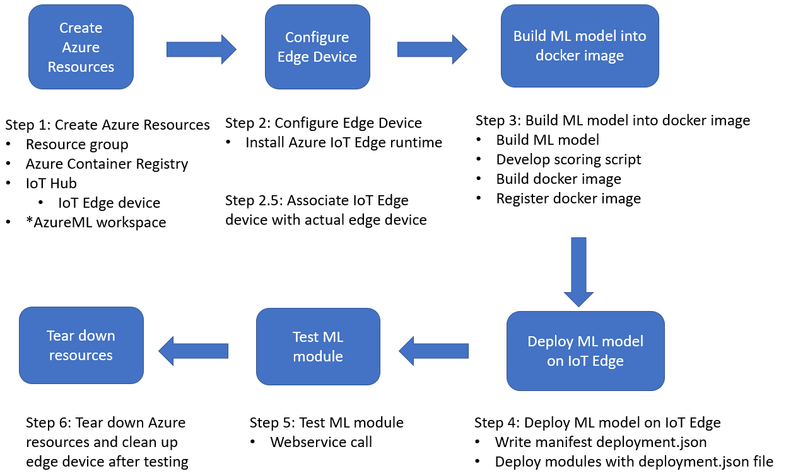

# Deploy Machine Learning Models on Azure IoT Edge

This repository contains examples and best practices for deploying machine learning (ML) models on Azure IoT Edge, provided as Jupyter notebooks. 

This topic leverages Artificial Intelligence (AI), Internet of Things (IoT), and Azure IoT Edge. Existing tutorials are mainly from the perspective of IoT or Edge, where the IoT pipeline and IoT Edge management are key components. In this tutorial, we shift the focus to the data science and the AI/ML model. We dig deeper on two aspects: where and how the ML model is built and what is the IoT Edge device for deployment.  

The table below lists the workflow options currently available in the repository. Notebooks are linked under the `Workflow` column when different implementations are available.

Workflow| Task | Model Built Environment | IoT Edge Device | Description | Notes|
| --- | --- | --- | --- | --- | --- |
[wf1](./image-classification-azureml)| Image Classification | Azure Machine Learning | Ubuntu VM (GPU) | Keras (Tensorflow), pretrained ResNet152 model | |
[wf2](./object-detection-azureml)| Object Detection | Azure Machine Learning | Ubuntu VM (GPU) | Pytorch, pretrained [MaskRCNN model](https://pytorch.org/blog/torchvision03/) | |
[wf3](./object-detection-acv)| Object Detection | Azure Custom Vision service | Ubuntu VM | Tensorflow, pretrained model, fine-tuned with 50 custom images| |
[wf4](./object-detection-acv-dbe)| Object Detection | Azure Custom Vision service | Data Box Edge (DBE) | Tensorflow, pretrained model, fine-tuned with 50 custom images |Make sure wf3 works first then try wf4 with the same model.|

The notebooks in each workflow directory is organized with six steps, which are illustrated in following digram. In `Step 1`, we create Azure resources including IoT hub, IoT edge device (a virtual edge device identity created under IoT hub), Azure Container Registry (ACR). If AzureML is used, an AzureML workspace will be created. This workspace manages models, images in ACR, etc.  In `Step 2`, we configure the actual edge device for deployment. The basic requrement for edge device is that [Azure IoT Edge runtime](https://docs.microsoft.com/en-us/azure/iot-edge/iot-edge-runtime) can be installed on the device. The IoT Edge runtime is a collection of programs that turn a device into an IoT Edge device. An edge device can be as small as a raspberry pi, or as powerful as a server-class machine. For detailed information please read [Azure IoT Edge supported systems](https://docs.microsoft.com/en-us/azure/iot-edge/support). In this repository, we show examples using different edge devices, including Ubuntu VM and Data Box Edge. Ubuntu VM is often used as a simulation edge device, since it provides convenient environment for testing and trouble shooting. When we deploy the modules succesfully on Ubuntu VM, we can perform the same deployment process on other devices such as Data Box Edge. In `Step 3`, we (1) develop an ML model, (2) build it into docker image, and (3) register it into ACR. When AzureML is used, (2) and (3) are taken care by AzureML. When ACV is used, (1) is performed in ACV. In `Step 4`, we deploy modules (running containers from docker images registered in ACR) on IoT edge device. In [wf1](./image-classification-azureml) and [wf2](./object-detection-azureml), we only show the deployment of the ML module. In [wf3](./object-detection-acv), we show the deployment of both ML module and an image-capture module. These two modules communicate with each other to fulfill the task. The objective is to demonstrate how the ML module is being used in real scenario. In `Step 5`, we show how to verify the ML module succesfully deployed. In `Step 6`, we provide scripts to tear down relevant Azure resources and clean up configurations on the edge device. 

The naming of the notebooks starts with `01`,`02`,`03`, ...,`06`, which match these steps. In the scenario where more than one notebooks are needed in one step, we apply another level of numbers in naming. For example, we use `031`,`032`,`033` to represent the sub-steps of Step 3 of [wf2](./object-detection-azureml). In the diagram, there is a special step called `Step 2.5`. It sets up the association between the IoT Edge device identity (Step 1) and the actual edge device (Step 2). For the sake of convenience, we include this step in `Step 2`. 

- Step 1: Create Azure Resources
- Step 2: Configure Edge Device
- Step 3: Build ML model into docker image
- Step 4: Deploy ML model on IoT Edge
- Step 5: Test ML module
- Step 6: Tear down resources

. 

## Azure IoT Edge
 [Azure IoT Edge](https://docs.microsoft.com/en-us/azure/iot-edge/how-iot-edge-works) is an Internet of Things (IoT) service that builds on top of Azure IoT Hub. It is a hybrid solution combining the benefits of the two scenarios: *IoT in the Cloud* and *IoT on the Edge*. This service is meant for customers who want to analyze data on devices, a.k.a. "at the edge", instead of in the cloud. By moving parts of your workload to the edge, your devices can spend less time sending messages to the cloud and react more quickly to changes in status. On the other hand, Azure IoT Hub provides centralized way to manage Azure IoT Edge devices, and make it easy to train ML models in the Cloud and deploy the trained models on the Edge devices.  

Following diagram shows the major components of an Azure IoT edge device. 

## Next Steps

Please navigate to tutorials: [wf1](./image-classification-azureml),[wf2](./object-detection-azureml),[wf3](./object-detection-acv), or [wf4](./object-detection-acv-dbe) to find out prerequisites and setup instructions.

## Reference
- [Ubuntu VM](https://docs.microsoft.com/en-us/azure/machine-learning/data-science-virtual-machine/dsvm-ubuntu-intro)
- [Azure Machine Learning service](https://docs.microsoft.com/en-us/azure/machine-learning/service/overview-what-is-azure-ml)
- [Azure Custom Vision service](https://docs.microsoft.com/en-us/azure/cognitive-services/custom-vision-service/home)
- [Data Box Edge](https://docs.microsoft.com/en-us/azure/databox-online/data-box-edge-overview)
- [Azure IoT Edge](https://docs.microsoft.com/en-us/azure/iot-edge/how-iot-edge-works)
- [Azure IoT Edge runtime](https://docs.microsoft.com/en-us/azure/iot-edge/iot-edge-runtime) 
- [Azure IoT Edge supported systems](https://docs.microsoft.com/en-us/azure/iot-edge/support)

## Contributing

This project welcomes contributions and suggestions.  Most contributions require you to agree to a
Contributor License Agreement (CLA) declaring that you have the right to, and actually do, grant us
the rights to use your contribution. For details, visit https://cla.opensource.microsoft.com.

When you submit a pull request, a CLA bot will automatically determine whether you need to provide
a CLA and decorate the PR appropriately (e.g., status check, comment). Simply follow the instructions
provided by the bot. You will only need to do this once across all repos using our CLA.

This project has adopted the [Microsoft Open Source Code of Conduct](https://opensource.microsoft.com/codeofconduct/).
For more information see the [Code of Conduct FAQ](https://opensource.microsoft.com/codeofconduct/faq/) or
contact [opencode@microsoft.com](mailto:opencode@microsoft.com) with any additional questions or comments.
